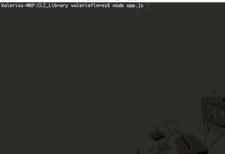

# CLI_Library
This terminal-based app allows users to view, add, edit, and remove books from the library.

## Getting Started
This app requires downloading and installation to use.  The information and demos are available [here](https://github.com/valeriemiller5/CLI_Library).

## Prerequisites
The package.json is included in the Github repository.  In order to run this app, the user will need to install the package with `npm install`.

### These packages are required to play the game:
### inquirer
`npm install inquirer`
### PostgreSQL
`npm install pg`
### chalk
This package adds color and font-weight to command line text for easier viewing.
`npm install chalk`

## Examples
### View Books
This allows the users to view all of the books currently in the library.

### Add Books
If the user would like to add a book to the library, they are able to do so with this option.

### Edit Books
If the user notices a change is required to any of the books in the library, they have the option to update the book information.

### Remove Books
If the user has accidentally repeated a book, or decides they no longer want a book in their library, they have the option to remove it.  In this example the book "The Raven" has been removed.

### Search Books
The user may know a certain word in the title of the book, but not the whole title.  This search allows them to use key words to find the book they're looking for.

## Built With
* Node.js - language used to build the app
* Chalk - a Node.js package used to prettify the data in the terminal with colors
* Inquirer - a Node.js package used to create question prompts
* PostgreSQL - a Node.js package used to allow Node to communicate with a SQL database

## License
This project is licensed under the MIT License - see the LICENSE.md file for details